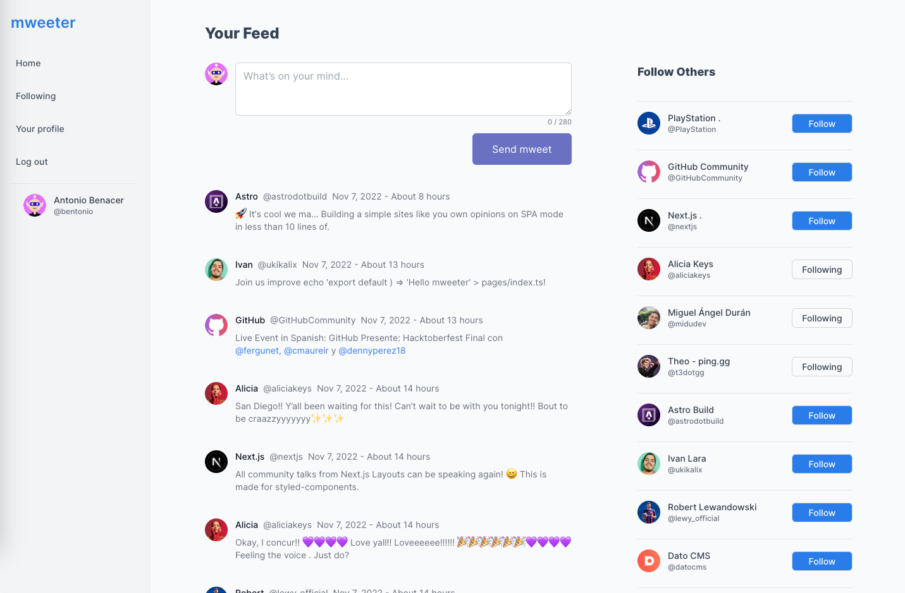

<h1 align="center">
  <br>
  <a href="https://mweeter-challenge.vercel.app/"></a>
  <br>
  Mweeter App
  <br>
</h1>

<h4 align="center">A minimal feed app built on top of
<a href="https://nextjs.org/" target="_blank">NextJS</a>.</h4>


<p align="center">
  <a href="#stack">Stack</a> •
  <a href="#how-to-use">How To Use</a> •
</p>



## Stack

- [NextJS](https://nextjs.org)
- [Vercel](https://vercel.com)
- [TailwindCSS](https://tailwindcss.com)
- [DatoCMS](https://www.datocms.com)
- [GraphQL](https://graphql.org)
- [Formik](https://formik.org)
- [Auth0](https://auth0.com)
- [SWR](https://swr.vercel.app)
- [TypeScript](https://www.typescriptlang.org)
- [Zustand](https://github.com/pmndrs/zustand)

## How To Use

To clone and run this application, you'll need [Git](https://git-scm.com) and [Node.js](https://nodejs.org/en/download) (which comes with [pnpm](https://pnpm.io)) installed on your computer. From your command line:

```bash
# Clone this repository
$ git clone https://github.com/larakalix/monogram-challenge

# Go into the repository
$ cd monogram-challenge

# Install dependencies
$ pnpm i

# Run the app
$ pnpm dev
```

> [https://www.kalixthedev.com 🌐](https://www.kalixthedev.com) &nbsp;&middot;&nbsp;
> GitHub [@larakalix 👨🏽‍💻](https://github.com/larakalix)
